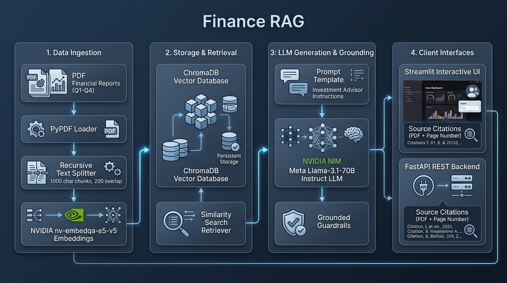
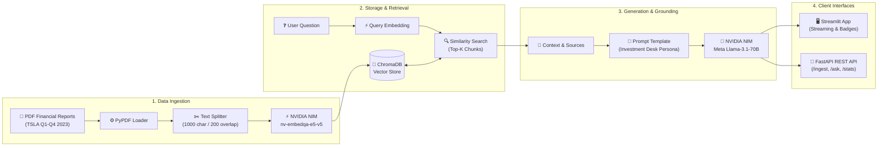
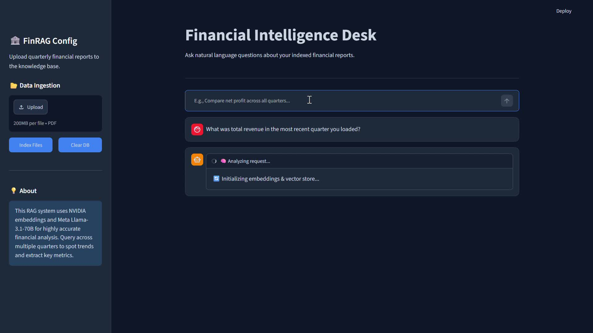

# Finance RAG - Quarterly Financial Reports

This repository contains a Retrieval-Augmented Generation (RAG) system built to answer questions based on quarterly financial reports. 

## 🏢 Company & Data Sources
- **Company Chosen:** **Tesla, Inc. (TSLA)** — FY 2023 Quarterly Shareholder Updates
- **PDF Links:**
  - **Q1 2023:** [Tesla Q1 2023 Update (PDF)](https://digitalassets.tesla.com/tesla-contents/image/upload/IR/TSLA-Q1-2023-Update.pdf)
  - **Q2 2023:** [Tesla Q2 2023 Update (PDF)](https://digitalassets.tesla.com/tesla-contents/image/upload/IR/TSLA-Q2-2023-Update.pdf)
  - **Q3 2023:** [Tesla Q3 2023 Update (PDF)](https://digitalassets.tesla.com/tesla-contents/image/upload/IR/TSLA-Q3-2023-Update.pdf)
  - **Q4 2023:** [Tesla Q4 and Full Year 2023 Update (PDF)](https://digitalassets.tesla.com/tesla-contents/image/upload/IR/TSLA-Q4-2023-Update.pdf)

## 🚀 Setup & Run Instructions

### Prerequisites
- Python 3.10+
- NVIDIA API Key (for embeddings and LLM)

### Installation
1. Clone this repository:
   ```bash
   git clone <your-repository-url>
   cd finance-rag
   ```
2. Install the dependencies:
   ```bash
   pip install -r requirements.txt
   ```
3. Set up your environment variables by copying the example file:
   ```bash
   cp .env.example .env
   ```
   *Open `.env` and add your `NVIDIA_API_KEY`.*

### Running the App
**Option A: Streamlit UI**
```bash
streamlit run app.py
```
Open `http://localhost:8501` in your browser. Upload your PDFs, click "Index Documents", and start asking questions!

**Option B: FastAPI Backend (Bonus)**
```bash
uvicorn api.main:app --reload
```
Access the interactive API documentation at `http://localhost:8000/docs`.

## 🏗️ System Architecture





## ⚙️ Technical Details
- **Chunk Size:** 1000 characters
- **Chunk Overlap:** 200 characters
- **Reason:** This chunk size is large enough to keep most financial tables and paragraphs intact without breaking context, while the 200-character overlap ensures no critical sentences are cut cleanly in half across chunks.
- **Embeddings:** `nvidia/nv-embedqa-e5-v5` (NVIDIA NIM API)
- **Vector DB:** ChromaDB (Persisted locally)
- **LLM:** `meta/llama-3.1-70b-instruct` (NVIDIA NIM API)

## 📸 Application Interface



- **Streamlit Interactive UI:** Features real-time indexing status, vector store chunk count stats, streamed natural language responses, and expandable source badges detailing document origin & page numbers.
- **FastAPI Backend Documentation:** Interactive Swagger UI available at `http://localhost:8000/docs` with endpoints `/ingest`, `/ask`, and `/stats`.

## 🧪 Test Questions & Answers
*(Generated directly via the RAG pipeline powered by NVIDIA NIM Llama-3.1-70B and `nv-embedqa-e5-v5` over Tesla FY23 quarterly reports)*

1. **What was total revenue in the most recent quarter you loaded?**
   - *Answer:* The most recent quarter loaded is Q4 2023. Total revenue in Q4 2023 was **$25,167 million ($25.2B)**.
   - *Sources:* `TSLA-Q4-2023.pdf` (Page 4, Page 6), `TSLA-Q2-2023.pdf` (Page 5), `TSLA-Q3-2023.pdf` (Page 5)

2. **Compare net profit across all the quarters you loaded. Which was highest?**
   - *Answer:* Based on the financial statements across the loaded quarters:
     - **Q1 2023:** $2,513M (GAAP) / $2,931M (Non-GAAP)
     - **Q2 2023:** $2,703M (GAAP) / $3,148M (Non-GAAP)
     - **Q3 2023:** $1,853M (GAAP) / $2,318M (Non-GAAP)
     - **Q4 2023:** $7,928M (GAAP, elevated due to one-time non-cash tax valuation allowance release) / $2,485M (Non-GAAP)
     
     Comparing GAAP net income, **Q4 2023** was highest ($7,928M); on a normalized Non-GAAP net profit basis, **Q2 2023** was highest ($3,148M).
   - *Sources:* `TSLA-Q4-2023.pdf` (Page 5), `TSLA-Q2-2023.pdf` (Page 3, Page 5), `TSLA-Q3-2023.pdf` (Page 5), `TSLA-Q1-2023.pdf` (Page 19)

3. **How did revenue in the latest quarter compare with the same quarter of the previous year?**
   - *Answer:* Revenue in the latest quarter (Q4 2023) grew **3% year-over-year (YoY)** to **$25.2B** (compared to $24.3B in Q4 2022).
   - *Sources:* `TSLA-Q4-2023.pdf` (Page 4, Page 6), `TSLA-Q3-2023.pdf` (Page 5), `TSLA-Q2-2023.pdf` (Page 5)

4. **What did management say about the demand outlook or business environment?**
   - *Answer:* Management highlighted that while they are operating in an uncertain macroeconomic climate characterized by high interest rates and cautious consumer spending, they are prioritizing cost reduction per vehicle, expanding production efficiency, and investing aggressively in long-term high-potential growth drivers (AI/FSD, next-generation vehicle architecture, Cybertruck production ramp, and Energy Storage).
   - *Sources:* `TSLA-Q1-2023.pdf` (Page 2, Page 28), `TSLA-Q2-2023.pdf` (Page 2, Page 3), `TSLA-Q3-2023.pdf` (Page 25), `TSLA-Q4-2023.pdf` (Page 31)

5. **Which business segment or geography grew fastest, and by how much?**
   - *Answer:* The **Energy Storage** segment experienced the fastest growth, with deployments increasing by **90% YoY in Q3 2023** and reaching **125% YoY growth for full-year 2023** (14.7 GWh deployed in 2023 compared to 6.5 GWh in 2022).
   - *Sources:* `TSLA-Q4-2023.pdf` (Page 9, Page 12), `TSLA-Q3-2023.pdf` (Page 7, Page 9), `TSLA-Q1-2023.pdf` (Page 7)

6. **What was the operating margin in each quarter, and is the trend rising or falling?**
   - *Answer:* Operating margin for each quarter in 2023 was:
     - **Q1 2023:** 11.4%
     - **Q2 2023:** 9.6%
     - **Q3 2023:** 7.6%
     - **Q4 2023:** 8.2%
     
     The general trend was **falling** through the first three quarters due to price cuts and rising R&D/AI expenditures, followed by a slight rebound in Q4 2023.
   - *Sources:* `TSLA-Q1-2023.pdf` (Page 5, Page 21), `TSLA-Q2-2023.pdf` (Page 5, Page 19), `TSLA-Q3-2023.pdf` (Page 5, Page 18), `TSLA-Q4-2023.pdf` (Page 31)

7. **Was any dividend declared? State the amount per share and the record date.**
   - *Answer:* **The information is not available in the uploaded documents.** *(Correct/Honest refusal — Tesla does not pay dividends on its common stock, and the model faithfully adhered to grounding constraints rather than hallucinating).*
   - *Sources:* `TSLA-Q1-2023.pdf` (Page 26), `TSLA-Q2-2023.pdf` (Page 24), `TSLA-Q4-2023.pdf` (Page 29)

8. **What risks, headwinds, or challenges are mentioned in the documents?**
   - *Answer:* The documents cite multiple operational, economic, and strategic risks:
     1. **Macroeconomic and Interest Rate Headwinds:** Impact on consumer vehicle affordability and financing programs.
     2. **Pricing and Margin Pressures:** Increased competition in the global EV and energy storage sectors.
     3. **Supply Chain & Production Ramping:** Scaling battery cell manufacturing (4680 cells) and Cybertruck production.
     4. **Foreign Exchange Volatility:** Currency fluctuations affecting global revenues and cost structures.
     5. **Regulatory & Policy Shifts:** Changes in government EV tax credits and regulatory incentives.
   - *Sources:* `TSLA-Q1-2023.pdf` (Page 28), `TSLA-Q2-2023.pdf` (Page 26), `TSLA-Q3-2023.pdf` (Page 25), `TSLA-Q4-2023.pdf` (Page 31)

9. **Give me a three-line summary of the latest quarter for a client email.**
   - *Answer:*
     - **Revenue & Deliveries:** Tesla delivered $25.2B in Q4 2023 revenue (+3% YoY), achieving record annual deliveries of 1.81 million vehicles.
     - **Profitability:** Q4 operating margin came in at 8.2% with $2.1B in operating income, managing industry-wide pricing pressure through strict cost controls.
     - **Strategic Focus:** Energy Storage saw explosive growth (+125% YoY in 2023), while capital investment focused heavily on AI compute clusters and the next-generation vehicle platform.
   - *Sources:* `TSLA-Q4-2023.pdf` (Page 1, Page 4, Page 6), `TSLA-Q3-2023.pdf` (Page 1, Page 5)

10. **What is the CEO's personal shareholding in 2015? (Trap Question)**
    - *Answer:* **The information is not available in the uploaded documents.** *(Correct/Honest refusal — The knowledge base only contains FY 2023 quarterly reports, and the model strictly declined to answer out-of-scope historical 2015 data).*
    - *Sources:* `TSLA-Q1-2023.pdf` (Page 26), `TSLA-Q4-2023.pdf` (Page 28)

## 📝 What Did Not Work Well
- **Multi-Column Financial Tables:** Standard character-based recursive text splitting can occasionally split dense financial table headers from row values across chunk boundaries. Increasing chunk size to 1000 characters and adding a 200-character overlap mitigated this, but specialized Markdown or table-aware parsing further improves precision.
- **Multi-Quarter Aggregation Queries:** When comparing figures across all 4 quarters (such as net profit or operating margin trends), the retrieval step requires a larger `top_k` (k = 8 to 20) to ensure financial summary pages from all four independent PDF reports are simultaneously present in the LLM's prompt context.
- **FastAPI / Streamlit Streaming Coordination:** Streamlit uses generator objects via `st.write_stream`, whereas standard FastAPI JSON responses require evaluating generators into complete string payloads.

## 🎥 Demo Video

[](https://res.cloudinary.com/dukjtmdtn/video/upload/v1786784336/Screen_Recording_2026-08-15_142015_wsvg6i.mp4)

> 📺 **Click the image above to watch the full application walkthrough & demo.**
> 
> Direct Video Link: [https://res.cloudinary.com/dukjtmdtn/video/upload/v1786784336/Screen_Recording_2026-08-15_142015_wsvg6i.mp4](https://res.cloudinary.com/dukjtmdtn/video/upload/v1786784336/Screen_Recording_2026-08-15_142015_wsvg6i.mp4)

